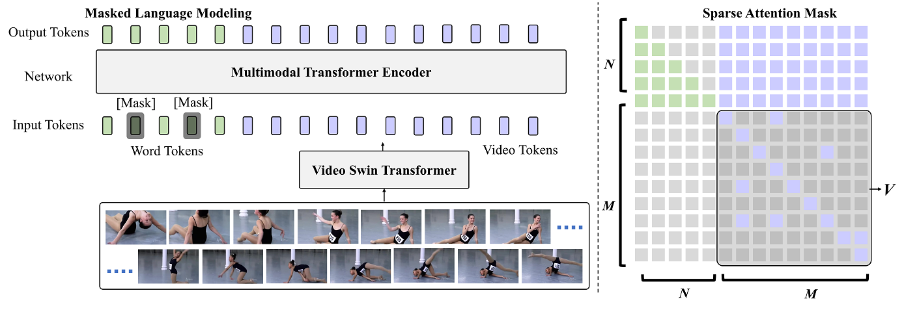

# SwinBERT

  

This is our research code for CVPR 2022 paper: [SwinBERT: End-to-End Transformers with Sparse Attention for Video Captioning](https://arxiv.org/abs/2111.13196). 

We present SwinBERT, an end-to-end transformer-based model for video captioning. SwinBERT takes video frame patches directly as inputs, and outputs a natural language description. In this repository, we provide our research code for training and testing SwinBERT for video captioning.

## News
  - 05/05/2022: Init release

## Released items
- [x] Training and evaluation code
- [x] Inference code
- [x] Models and training logs
- [x] TSV dataset annotations
- [ ] Tutorial for Frame-based TSV generation


## Table of contents
* [Model Card](#Model-Card)
* [Requirements](#Requirements)
* [Download](#Download)
* [Launch Docker Container](#before-running-code-launch-docker-container)
* [Quick Demo](#Quick-Demo)
* [Evaluation](#Evaluation)
* [Training](#Training)
* [Citation](#Citation)
* [License](#License)
* [Acknowledgments](#Acknowledgments)


## Model Card

* We release our best performing checkpoints for each dataset (corresponding to Table 1 in our paper). For clarity, we report performance on both validation and test splits below. 

* We also report our results on private test splits, where the scores are obtained from [VALUE Leaderboard Evaluation Server](https://competitions.codalab.org/competitions/34470).


| Dataset | Checkpoint | CIDEr (val split) | CIDEr (test split) | CIDEr (private test split) |
| --------------- | :-------------: | :-------------: | :-------------: | :-------------: |
| VATEX | [URL](https://datarelease.blob.core.windows.net/swinbert/models/vatex-table1.zip) | 84.4 | 73.0 | 74.35 |
| MSRVTT | [URL](https://datarelease.blob.core.windows.net/swinbert/models/msrvtt-table1.zip) | 55.1 | 53.8 | N/A |
| MSVD | [URL](https://datarelease.blob.core.windows.net/swinbert/models/msvd-table1.zip) | 160 | 120.6 | N/A |
| TVC | [URL](https://datarelease.blob.core.windows.net/swinbert/models/tvc-table1.zip) | 57.0 | N/A | 49.74 |
| YouCook2 | [URL](https://datarelease.blob.core.windows.net/swinbert/models/youcook2-table1.zip) | 109 | N/A | 101.39 |


* We also release our 32-frame model below. 

| Dataset | Checkpoint | CIDEr (val split) | CIDEr (test split) | CIDEr (private test split) |
| --------------- | :-------------: | :-------------: | :-------------: | :-------------: |
| VATEX | [URL](https://datarelease.blob.core.windows.net/swinbert/models/vatex-32frm.zip) | 82.1 | 71.6 | 73.06 |
| MSRVTT | [URL](https://datarelease.blob.core.windows.net/swinbert/models/msrvtt-table1.zip) | 55.1 | 53.8 | N/A |
| MSVD | [URL](https://datarelease.blob.core.windows.net/swinbert/models/msvd-32frm.zip) | 147.6 | 109.4 | N/A |
| TVC | [URL](https://datarelease.blob.core.windows.net/swinbert/models/tvc-32frm.zip) | 53.8 | N/A | 47.6 |
| YouCook2 | [URL](https://datarelease.blob.core.windows.net/swinbert/models/youcook2-32frm.zip) | 104.8 | N/A | 97.69 |

* Note: All results are based on single model. No CIDEr optimization used in our experiments.

## Requirements 
We provide a [Docker image](https://hub.docker.com/r/linjieli222/videocap_torch1.7/tags) for easier reproduction. Please install the following:
  - [nvidia driver](https://docs.nvidia.com/cuda/cuda-installation-guide-linux/index.html#package-manager-installation) (418+), 
  - [Docker](https://docs.docker.com/install/linux/docker-ce/ubuntu/) (19.03+), 
  - [nvidia-container-toolkit](https://github.com/NVIDIA/nvidia-docker#quickstart).

We only support Linux with NVIDIA GPUs. We test on Ubuntu 18.04 and V100 cards.
We use mixed-precision training hence GPUs with Tensor Cores are recommended.
Our scripts require the user to have the [docker group membership](https://docs.docker.com/install/linux/linux-postinstall/)
so that docker commands can be run without sudo.

## Download

1. Create folders that store pretrained models, datasets, and predictions.
    ```bash
    export REPO_DIR=$PWD
    mkdir -p $REPO_DIR/models  # pre-trained models
    mkdir -p $REPO_DIR/datasets  # datasets
    mkdir -p $REPO_DIR/predictions  # prediction outputs
    ```

2. Download pretrained models.

    Our pre-trained models can be downloaded with the following command.
    ```bash
    cd $REPO_DIR
    bash scripts/download_models.sh
    ```
    The script will download our models that are trained for VATEX, MSRVTT, MSVD, TVC and YouCook2, respectively. It will also download our training logs and output predictions. 

    The resulting data structure should follow the hierarchy as below. 
    ```
    ${REPO_DIR}  
    |-- models  
    |   |-- table1
    |   |   |-- vatex
    |   |   |   |-- best-checkpoint
    |   |   |   |   |-- model.bin
    |   |   |   |   |-- optmizer_state.bin
    |   |   |   |   |-- pred.*
    |   |   |   |-- tokenizer
    |   |   |   |   |-- added_tokens.json
    |   |   |   |   |-- special_tokens_map.json
    |   |   |   |   |-- vocab.txt
    |   |   |   |-- log
    |   |   |   |   |-- log.txt
    |   |   |   |   |-- args.json
    |   |   |-- msrvtt
    |   |   |-- msvd
    |   |   |-- tvc
    |   |   |-- youcook2
    |   |-- 32frm
    |   |   |-- vatex
    |   |   |   |-- best-checkpoint
    |   |   |   |   |-- model.bin
    |   |   |   |   |-- optmizer_state.bin
    |   |   |   |   |-- pred.*
    |   |   |   |-- tokenizer
    |   |   |   |   |-- added_tokens.json
    |   |   |   |   |-- special_tokens_map.json
    |   |   |   |   |-- vocab.txt
    |   |   |   |-- log
    |   |   |   |   |-- log.txt
    |   |   |   |   |-- args.json
    |   |   |-- msrvtt
    |   |   |-- msvd
    |   |   |-- tvc
    |   |   |-- youcook2
    |-- docs 
    |-- src
    |-- scripts 
    |-- README.md 
    |-- ... 
    |-- ... 
    ```

3. Download pretrained Video Swin Transformers.

    To run our code smoothly, please visit [Video Swin Transformer](https://github.com/SwinTransformer/Video-Swin-Transformer) to download pre-trained weights models.

    Download `swin_base_patch244_window877_kinetics*_22k.pth`, 
    and place them under `${REPO_DIR}/models/video_swin_transformer` directory.
    The data structure should follow the hierarchy below.
    ```
    ${REPO_DIR}  
    |-- models  
    |   |-- video_swin_transformer
    |    |   |-- swin_base_patch244_window877_kinetics600_22k.pth
    |    |   |-- swin_base_patch244_window877_kinetics400_22k.pth
    |   |-- table1
    |   |-- 32frm
    |-- docs 
    |-- src
    |-- scripts 
    |-- README.md 
    |-- ... 
    |-- ... 
    ```

4. Download prediction files that were evaluated on [VALUE Leaderboard Evaluation Server](https://competitions.codalab.org/competitions/34470)

    The prediction files can be downloaded with the following command.
    ```bash
    cd $REPO_DIR
    bash scripts/download_value_preds.sh
    ```
    You could submit the prediction files to VALUE Leaderboard and reproduce our results.

5. Download datasets for training and evaluation

    In this project, we provide our pre-parsed annotation files in TSV format. To download the files, please use the following command.
    ```bash
    cd $REPO_DIR
    bash scripts/download_annotations.sh
    ```
    
    Following prior studies, we use the standard train/val/test splits for each dataset. Here, we just reorganize the data format in TSV files to better fit our codebase. 

    **Due to copyright issue, we could not release the raw videos.** We suggest downloading the orignal raw videos from the official dataset websites. Please place the downloaded videos under `raw_videos` or `videos` of each dataset folder. 

    The `datasets` directory structure should follow the below hierarchy.
    ```
    ${ROOT}  
    |-- datasets  
    |   |-- VATEX  
    |   |   |-- *.yaml 
    |   |   |-- *.tsv  
    |   |   |-- raw_videos  <<< please place the downloaded videos under this folder 
    |   |   |   |-- val_all
    |   |   |   |   |-- *.mp4
    |   |   |   |-- holdout_test
    |   |   |   |   |-- test
    |   |   |   |   |   |-- *.mp4
    |   |-- MSRVTT-v2  
    |   |   |-- *.yaml 
    |   |   |-- *.tsv  
    |   |   |-- videos <<< please place the downloaded videos under this folder 
    |   |   |   |-- *.mp4 
    |   |-- MSVD  
    |   |   |-- *.yaml 
    |   |   |-- *.tsv  
    |   |   |-- videos <<< please place the downloaded videos under this folder 
    |   |   |   |-- *.avi 
    |   |-- TVC  
    |   |   |-- *.yaml 
    |   |   |-- *.tsv  
    |   |   |-- videos <<< please place the downloaded videos under this folder 
    |   |   |   |-- bbt_new
    |   |   |   |-- castle
    |   |   |   |-- friends
    |   |   |   |-- grey
    |   |   |   |-- house
    |   |   |   |-- met 
    |   |-- YouCook2  
    |   |   |-- *.yaml 
    |   |   |-- *.tsv  
    |   |   |-- training <<< please place the downloaded training videos under this folder 
    |   |   |   |-- *.mp4 
    |   |   |-- validation <<< please place the downloaded validation videos under this folder 
    |   |   |   |-- *.mp4 
    |   |   |-- testing <<< please place the downloaded testing videos under this folder 
    |   |   |   |-- *.mp4 
    |-- docs
    |-- src
    |-- scripts
    |-- models 
    |-- README.md 
    |-- ... 
    |-- ... 

    ```

    We also provide example scripts to reproduce our annotation tsv files. You may find the examples below.
    ```
    ${ROOT}  
    |-- prepro  
    |   |-- tsv_preproc_vatex.py
    |   |-- tsv_preproc_msrvtt.py
    |   |-- tsv_preproc_msvd.py
    |   |-- tsv_preproc_tvc.py
    |   |-- tsv_preproc_youcook2.py
    |-- docs
    |-- src
    |-- scripts
    |-- README.md 
    |-- ... 
    |-- ... 

    ```


## Before Running Code: Launch Docker Container 

We provide a [Docker image](https://hub.docker.com/r/linjieli222/videocap_torch1.7/tags) for easier reproduction. Please launch the docker container before running our codes. 

```bash
export REPO_DIR=$PWD
DATASETS=$REPO_DIR'/datasets/'
MODELS=$REPO_DIR'/models/'
OUTPUT_DIR=$REPO_DIR'/output/'
source launch_container.sh $DATASETS $MODELS $OUTPUT_DIR
```

Our latest docker image `linjieli222/videocap_torch1.7:fairscale` supports the following mixed precision training
- [x] Torch.amp (with limited GPU memory optimization, deprecated from this codebase)
- [x] Nvidia Apex O2
- [x] deepspeed (Best setting on VATEX, deepspeed fp16 with zero_opt_stage=1)
- [x] fairscale


## Quick Demo
We provide a demo to run end-to-end inference on the test video.

Our inference code will take a video as input, and generate video caption.

```bash
# After launching the docker container 
EVAL_DIR='./models/table1/vatex/best-checkpoint/'
CHECKPOINT='./models/table1/vatex/best-checkpoint/model.bin'
VIDEO='./docs/G0mjFqytJt4_000152_000162.mp4'
CUDA_VISIBLE_DEVICES=0 python src/tasks/run_caption_VidSwinBert_inference.py \
       --resume_checkpoint $CHECKPOINT  \
       --eval_model_dir $EVAL_DIR \
       --test_video_fname $VIDEO \
       --do_lower_case \
       --do_test 
```

The prediction should look like

```bash
Prediction: a young boy is showing how to make a paper airplane.
```

## Evaluation

We provide example scripts to evaluate pre-trained checkpoints

### VATEX
```bash
# Assume in the docker container 
EVAL_DIR='./models/table1/vatex/best-checkpoint/'
CUDA_VISIBLE_DEVICES=0 python src/tasks/run_caption_VidSwinBert.py \
       --val_yaml VATEX/public_test_128frames.yaml  \
       --do_eval true \
       --do_train false \
       --eval_model_dir $EVAL_DIR
```

Notes: Our dataloader supports two different modes:
- [x] Online decoding: Extract video frames on-the-fly during experiments. It has less data prepro efforts. 
- [x] Offline decoding: Need to store all the extracted frames in a TSV file. But it usually run faster. 

For online decoding, please use `VATEX/public_test.yaml`
For offline decoding, please use  `VATEX/public_test_128frames.yaml`


### MSRVTT

```bash
# Assume in the docker container 
EVAL_DIR='./models/table1/msrvtt/best-checkpoint/'
CUDA_VISIBLE_DEVICES=0 python src/tasks/run_caption_VidSwinBert.py \
       --val_yaml MSRVTT-v2/val_128frames.yaml  \
       --do_eval true \
       --do_train false \
       --eval_model_dir $EVAL_DIR
```
For online decoding, please use `MSRVTT-v2/val.yaml`
For offline decoding, please use  `MSRVTT-v2/val_128frames.yaml`

### YouCook2

```bash
# Assume in the docker container 
EVAL_DIR='./models/table1/youcook2/best-checkpoint/'
CUDA_VISIBLE_DEVICES=0 python src/tasks/run_caption_VidSwinBert.py \
       --val_yaml YouCook2/testing_128frames.yaml  \
       --do_eval true \
       --do_train false \
       --eval_model_dir $EVAL_DIR
```

For online decoding, please use `YouCook2/testing.yaml`
For offline decoding, please use  `YouCook2/testing_128frames.yaml`

### MSVD

```bash
# Assume in the docker container 
EVAL_DIR='./models/table1/msvd/best-checkpoint/'
CUDA_VISIBLE_DEVICES=0 python src/tasks/run_caption_VidSwinBert.py \
       --val_yaml MSVD/val_32frames.yaml  \
       --do_eval true \
       --do_train false \
       --eval_model_dir $EVAL_DIR
```
For online decoding, please use `MSVD/val.yaml`
For offline decoding, please use  `MSVD/val_32frames.yaml`

### TVC

```bash
# Assume in the docker container 
EVAL_DIR='./models/table1/tvc/best-checkpoint/'
CUDA_VISIBLE_DEVICES=0 python src/tasks/run_caption_VidSwinBert.py \
       --val_yaml TVC/val_128frames.yaml  \
       --do_eval true \
       --do_train false \
       --eval_model_dir $EVAL_DIR
```
For online decoding, please use `TVC/val.yaml`
For offline decoding, please use  `TVC/val_128frames.yaml`

## Training

We provide example scripts to train our model (with 32-frame inputs, soft sparse attention)

### VATEX

```bash
# Assume in the docker container 
python src/tasks/run_caption_VidSwinBert.py
        --config src/configs/VidSwinBert/vatex_8frm_default.json
        --train_yaml VATEX/train_32frames.yaml
        --val_yaml VATEX/public_test_32frames.yaml
        --per_gpu_train_batch_size 6
        --per_gpu_eval_batch_size 6
        --num_train_epochs 15
        --learning_rate 0.0003
        --max_num_frames 32
        --pretrained_2d 0
        --backbone_coef_lr 0.05
        --mask_prob 0.5
        --max_masked_token 45
        --zero_opt_stage 1
        --mixed_precision_method deepspeed
        --deepspeed_fp16
        --gradient_accumulation_steps 1
        --learn_mask_enabled
        --loss_sparse_w 0.5
        --output_dir ./output
```

### MSRVTT
```bash
# Assume in the docker container 
python src/tasks/run_caption_VidSwinBert.py
        --config src/configs/VidSwinBert/msrvtt_8frm_default.json
        --train_yaml MSRVTT-v2/train_32frames.yaml
        --val_yaml MSRVTT-v2/val_32frames.yaml
        --per_gpu_train_batch_size 6
        --per_gpu_eval_batch_size 6
        --num_train_epochs 15
        --learning_rate 0.0003
        --max_num_frames 32
        --pretrained_2d 0
        --backbone_coef_lr 0.05
        --mask_prob 0.5
        --max_masked_token 45
        --zero_opt_stage 1
        --mixed_precision_method deepspeed
        --deepspeed_fp16
        --gradient_accumulation_steps 4
        --learn_mask_enabled
        --loss_sparse_w 0.5
        --output_dir ./output
```
### YouCook2
```bash
# Assume in the docker container 
python src/tasks/run_caption_VidSwinBert.py
        --config src/configs/VidSwinBert/youcook2_8frm_default.json
        --train_yaml YouCook2/training_128frames.yaml
        --val_yaml YouCook2/validation_128frames.yaml
        --per_gpu_train_batch_size 6
        --per_gpu_eval_batch_size 6
        --num_train_epochs 40
        --learning_rate 0.0003
        --max_num_frames 32
        --pretrained_2d 0
        --backbone_coef_lr 0.05
        --mask_prob 0.5
        --max_masked_token 45
        --zero_opt_stage 1
        --mixed_precision_method deepspeed
        --deepspeed_fp16
        --gradient_accumulation_steps 4
        --learn_mask_enabled
        --loss_sparse_w 0.5
        --output_dir ./output
```
### MSVD
```bash
# Assume in the docker container 
python src/tasks/run_caption_VidSwinBert.py
        --config src/configs/VidSwinBert/msvd_8frm_default.json
        --train_yaml MSVD/train_32frames.yaml
        --val_yaml MSVD/val_32frames.yaml
        --per_gpu_train_batch_size 6
        --per_gpu_eval_batch_size 6
        --num_train_epochs 15
        --learning_rate 0.0003
        --max_num_frames 32
        --pretrained_2d 0
        --backbone_coef_lr 0.05
        --mask_prob 0.5
        --max_masked_token 45
        --zero_opt_stage 1
        --mixed_precision_method deepspeed
        --deepspeed_fp16
        --gradient_accumulation_steps 1
        --learn_mask_enabled
        --loss_sparse_w 0.5
        --output_dir ./output
```
### TVC
```bash
# Assume in the docker container 
python src/tasks/run_caption_VidSwinBert.py
        --config src/configs/VidSwinBert/tvc_8frm_default.json
        --train_yaml TVC/train_128frames.yaml
        --val_yaml TVC/val_128frames.yaml
        --per_gpu_train_batch_size 6
        --per_gpu_eval_batch_size 6
        --num_train_epochs 40
        --learning_rate 0.0003
        --max_num_frames 32
        --pretrained_2d 0
        --backbone_coef_lr 0.05
        --mask_prob 0.5
        --max_masked_token 45
        --zero_opt_stage 1
        --mixed_precision_method apex
        --amp_opt_level 2
        --gradient_accumulation_steps 1
        --learn_mask_enabled
        --loss_sparse_w 0.1
        --output_dir ./output
```

## Citation

If you find our work useful in your research, please consider citing:

```bibtex
@inproceedings{lin2021end-to-end,
title={SwinBERT: End-to-End Transformers with Sparse Attention for Video Captioning},
author={Lin, Kevin and Li, Linjie and Lin, Chung-Ching and Ahmed, Faisal and Gan, Zhe and Liu, Zicheng and Lu, Yumao and Wang, Lijuan},
booktitle = {CVPR},
year = {2022},
}
```

## License

Our research code is released under MIT license.

## Contributing

This project welcomes contributions and suggestions.  Most contributions require you to agree to a
Contributor License Agreement (CLA) declaring that you have the right to, and actually do, grant us
the rights to use your contribution. For details, visit https://cla.opensource.microsoft.com.

When you submit a pull request, a CLA bot will automatically determine whether you need to provide
a CLA and decorate the PR appropriately (e.g., status check, comment). Simply follow the instructions
provided by the bot. You will only need to do this once across all repos using our CLA.

This project has adopted the [Microsoft Open Source Code of Conduct](https://opensource.microsoft.com/codeofconduct/).
For more information see the [Code of Conduct FAQ](https://opensource.microsoft.com/codeofconduct/faq/) or
contact [opencode@microsoft.com](mailto:opencode@microsoft.com) with any additional questions or comments.

## Trademarks

This project may contain trademarks or logos for projects, products, or services. Authorized use of Microsoft 
trademarks or logos is subject to and must follow 
[Microsoft's Trademark & Brand Guidelines](https://www.microsoft.com/en-us/legal/intellectualproperty/trademarks/usage/general).
Use of Microsoft trademarks or logos in modified versions of this project must not cause confusion or imply Microsoft sponsorship.
Any use of third-party trademarks or logos are subject to those third-party's policies.


## Acknowledgments

We thank Jianfeng Wang, Xiaowei Hu, Lin Liang, Zhengyuan Yang, Ehsan Azarnasab, 
Yue Cao, Lei Ji, Huaishao Luo and Ze Liu for their helpful discussions.

We also thank the anonymous reviewers for their constructive feedback.

Our code is built on top of open-source GitHub repositories. 
We thank all the authors who made their code public, which tremendously accelerates our project progress. 
If you find these works helpful, please consider citing them as well.

[huggingface/transformers](https://github.com/huggingface/transformers) 

[jayleicn/ClipBERT](https://github.com/jayleicn/ClipBERT) 

[linjieli222/HERO](https://github.com/linjieli222/HERO)

[Microsoft/Oscar&VinVL](https://github.com/microsoft/Oscar) 

[Microsoft/DeepSpeed](https://github.com/microsoft/DeepSpeed)

[Nvidia/Apex](https://github.com/NVIDIA/apex)

[FAIR/SlowFast](https://github.com/facebookresearch/SlowFast) 

[FAIR/FairScale](https://github.com/facebookresearch/fairscale)


